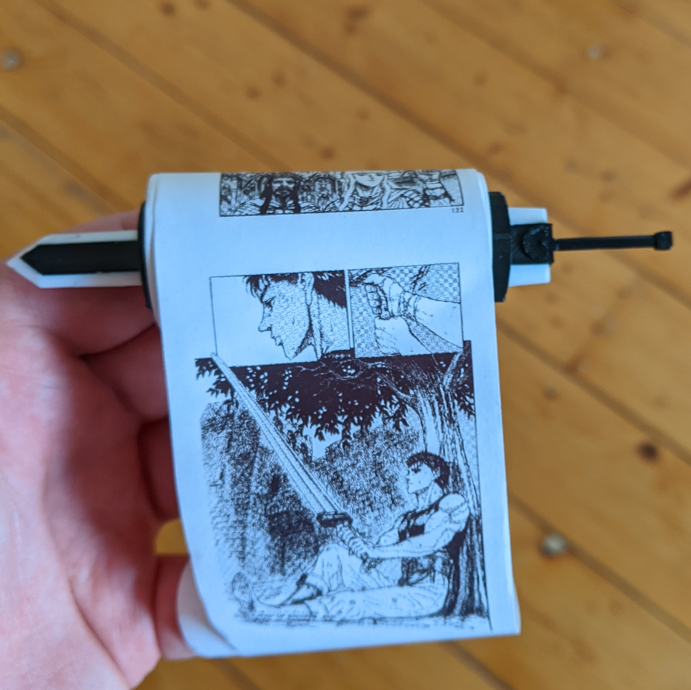

# Reciept Printer Scroll

This project is for making a small scroll using a thermal printer.

## Description

This project takes a folder of images and prints them out in lexical order on a reciept printer.

There are stl files included to make a small scroll for the reciept to be printed on



## Getting Started

This project requires Python 3 and the libraries in requirement.txt

### Installing Required Libraries

```
    pip install -r requirements.txt
```

### Executing program
```
    python3 main.py [input image directory]
```
After running this disconnect and reconnect your printer (make sure it is on) and it will find it automatically and start printing.

## Acknowledgments

Original Sword stl
* [PotionOcean](https://www.thingiverse.com/potionocean/designs)